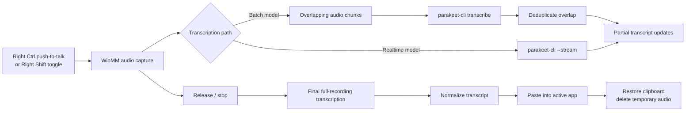

# Parakeet PTT

[](https://github.com/discostew6082/par-win-ptt/actions/workflows/ci.yml)

**Local Windows dictation powered by `parakeet.cpp`, with partial transcription while you are still speaking.**

Hold Right Ctrl, speak, and Parakeet PTT captures audio locally and begins producing transcript updates before the utterance is finished. Release the key and the app performs a final transcription pass, normalizes the result, pastes it into the active application, and restores the previous clipboard when possible.

The default path works with batch Parakeet models by transcribing overlapping audio chunks during recording. Streaming-capable models can instead use native `parakeet-cli --stream`.

## Why it exists

Local speech-to-text is much less useful for interactive dictation if nothing appears until the entire recording is complete. Parakeet PTT is built around reducing that perceived latency while keeping transcription local and preserving a clean final result.

It is a native Windows application rather than a browser wrapper: audio capture, global hotkeys, tray UI, transcript preview, clipboard paste, runtime/model management, and release packaging are all part of the application.

## What it does

- **Push-to-talk dictation:** hold Right Ctrl to record, then release to finalize and paste.
- **Toggle dictation:** optionally use Right Shift to start and stop recording.
- **Partial transcription while recording:** batch models are processed in overlapping chunks so transcript updates can appear before recording ends.
- **Overlap-aware assembly:** word timing and text overlap are used to avoid repeating content between adjacent chunks.
- **Clean final pass:** release triggers transcription of the complete recording before the normalized result is pasted.
- **Native streaming:** compatible realtime models can use `parakeet-cli --stream` instead of the chunked batch path.
- **Local inference:** transcription runs through a local `parakeet.cpp` runtime and GGUF model.
- **GPU with fallback:** CUDA is preferred when available, with an automatic CPU retry path if CUDA transcription fails.
- **Session-only history:** transcripts are kept only for the current application session.
- **Local experimentation:** runtime and model paths can be overridden in settings.

## Streaming and chunking

For ordinary batch models, Parakeet PTT does not simply wait for the final WAV file.

While recording:

1. WinMM captures 16-bit, 16 kHz mono PCM audio.
2. The recorder emits overlapping audio chunks.
3. Each chunk is sent through `parakeet-cli` while recording continues.
4. The incremental transcript assembler removes overlap using word timestamps when available and lexical overlap as a fallback.
5. Stable partial text is published to the live transcript UI.

When recording stops, outstanding chunk work is cancelled or allowed to settle, and the complete recording is transcribed once more. That final transcript is normalized and pasted into the active application. The final full-file pass keeps the low-latency preview path separate from the authoritative text that is actually pasted.

Streaming-capable realtime models take a different path: in `Auto` mode the app can use native `parakeet-cli --stream` rather than repeatedly invoking batch transcription on chunks.



## Engineering highlights

- **Native Windows integration:** `NotifyIcon` tray app, Windows Forms settings/history UI, low-level keyboard hook, non-activating topmost status overlay, and audible state feedback.
- **Audio path:** direct WinMM capture with temporary WAV files suitable for `parakeet-cli`.
- **Incremental inference:** overlapping chunk transcription runs while capture continues instead of blocking on the full utterance.
- **Transcript reconciliation:** chunk results are assembled without blindly appending repeated overlap text.
- **Runtime management:** CUDA and CPU runtimes are managed separately, with automatic CPU fallback after CUDA transcription failure.
- **Asset integrity:** downloaded runtimes and built-in GGUF models are checked with pinned SHA-256 hashes; extracted runtime files are revalidated through a manifest.
- **Archive hardening:** runtime zip entries are validated before extraction so paths cannot escape the runtime directory.
- **Operational behavior:** process timeout/cancellation handling, single-instance enforcement, best-effort clipboard restoration, session-only transcript history, and cleanup warnings when temporary audio cannot be deleted.
- **Release engineering:** Windows CI, locked NuGet restore, dependency audit, release packaging, SHA-256 checksums, CycloneDX SBOM generation, and public-build artifact attestation.


## Start with the interesting code

- [`ChunkedTranscribingDictationSession.cs`](src/ParakeetPtt.Core/ChunkedTranscribingDictationSession.cs) — overlapping-chunk scheduling and incremental transcript assembly.
- [`ParakeetCliTranscriber.cs`](src/ParakeetPtt.Core/ParakeetCliTranscriber.cs) — `parakeet.cpp` process integration, streaming, cancellation, and CUDA-to-CPU fallback.
- [`CoreBehaviorTests.cs`](tests/ParakeetPtt.Tests/CoreBehaviorTests.cs) — behavioral coverage for chunk reconciliation, transcription modes, asset validation, and failure paths.

## Privacy and trust boundaries

Parakeet PTT is designed for local dictation. Audio recording and transcription happen on the local machine, and transcript history is session-only. First use may download the selected `parakeet.cpp` runtime and model unless local paths are configured.

Important boundaries:

- Paste is implemented through the Windows clipboard. The transcript is placed on the clipboard briefly, pasted into the active application, and the previous clipboard contents are restored when possible. Other local applications with clipboard access could observe the clipboard during that interval.
- Runtime and model overrides execute local files selected by the user and should only point to trusted artifacts.
- The global hotkey uses a low-level Windows keyboard hook to detect Right Ctrl while the app is running. It is used for hotkey state, not transcript collection.
- Runtime and model downloads leave the machine to fetch third-party artifacts; transcription itself stays local.

## Requirements

- Windows 11, or Windows 10 installations still receiving security updates.
- .NET 10 SDK for development.
- A working audio input device.

Supported releases target Windows x64. The app targets .NET 10 LTS, supported until November 14, 2028.

## Build and run

Run the tests:

```powershell
dotnet test ParakeetPtt.sln
```

Publish a self-contained Windows x64 build:

```powershell
dotnet publish src\ParakeetPtt.App\ParakeetPtt.App.csproj -c Release -r win-x64 --self-contained true -o publish\win-x64
```

The executable will be under:

```text
publish\win-x64\ParakeetPtt.App.exe
```

Package the published folder:

```powershell
Compress-Archive -Path publish\win-x64\* -DestinationPath publish\ParakeetPtt-win-x64.zip -Force
```

Generate a release checksum:

```powershell
Get-FileHash publish\ParakeetPtt-win-x64.zip -Algorithm SHA256
```

## Models and transcription modes

On first use the app downloads assets under `%LOCALAPPDATA%\ParakeetPtt` unless trusted local paths are configured.

The built-in setup includes:

- `parakeet.cpp` `v0.4.0` Windows CUDA runtime plus its matching CUDA dependency archive.
- CPU fallback runtime.
- Default `tdt_ctc-110m-f16.gguf` model from `mudler/parakeet-cpp-gguf`.

First-run downloads can be hundreds of MB. The optional larger multilingual model is about 1.4 GB.

For native streaming, select one of the experimental realtime models in settings:

- `Parakeet Realtime EOU 120M Q8_0`
- `Parakeet Realtime EOU 120M F16`

Leave transcription mode on `Auto` to use native `parakeet-cli --stream` for streaming-capable models and the chunked path for batch models. `Batch` and `Streaming` modes are also available for explicit testing.

## Release integrity

This repository is MIT licensed, but downloaded runtimes and models are third-party artifacts with their own license terms.

- `parakeet.cpp` runtime archives come from the `mudler/parakeet.cpp` GitHub release `v0.4.0` and are checked against pinned SHA-256 hashes before extraction.
- Built-in GGUF models come from `mudler/parakeet-cpp-gguf` on Hugging Face and are checked for minimum expected size and pinned SHA-256 hashes.

Release builds publish the portable zip, checksum, and CycloneDX SBOM. Public tag builds also create a GitHub artifact attestation and a draft GitHub Release for review before publication.

Code signing is not currently configured, so Windows SmartScreen may warn on broadly distributed builds.

## Validation

Run the normal validation path with:

```powershell
dotnet test ParakeetPtt.sln
dotnet publish src\ParakeetPtt.App\ParakeetPtt.App.csproj -c Release -r win-x64 --self-contained true -o publish\win-x64
```

A local CPU smoke test with `parakeet-v0.4.0-bin-win-cpu-x64.zip` and `tdt_ctc-110m-f16.gguf` produced:

```json
{"text":"Hello parakeet push to talk."}
```

Chunked dictation smoke checks on July 3, 2026 used the same local CPU runtime and model. The CLI returned word-level timing metadata, which the chunked path can use when reconciling overlap.

An overlapped sample split into 2.5-second chunks with 0.8-second overlap produced:

| Context | Wall time | Transcript |
| --- | ---: | --- |
| chunk 1 | 160 ms | Hello parakeet push to talk. |
| chunk 2 | 149 ms | to talk. |
| full sample | 199 ms | Hello parakeet push to talk. |

A useful manual end-to-end smoke check is:

```text
1. Start Parakeet PTT from a local build.
2. Hold Right Ctrl and speak for at least 8 seconds with a pause near a chunk boundary.
3. Confirm partial transcript updates appear while recording remains active.
4. Release Right Ctrl and confirm the final pasted transcript is clean.
5. Repeat with Right Shift toggle mode and confirm the second press finalizes transcription.
```

Realtime streaming model smoke can be rerun with:

```powershell
powershell -ExecutionPolicy Bypass -File .\scripts\Test-RealtimeStreaming.ps1 -Runtime both -Iterations 3
```

The script downloads and verifies the realtime EOU models through `hf` when needed, runs the local smoke WAV through CPU and CUDA runtimes, and writes `smoke\streaming-smoke-results.md`.

## Current limitations

- Supported builds target Windows 10/11 on x64 only.
- Hotkeys are currently fixed to Right Ctrl for push-to-talk and Right Shift for toggle dictation.
- First use requires large runtime/model downloads unless trusted local paths are configured.
- Release artifacts are not code-signed yet.

## Contributing

See [CONTRIBUTING.md](CONTRIBUTING.md) for development setup and pull request guidance.

## License

Parakeet PTT is available under the [MIT License](LICENSE).
