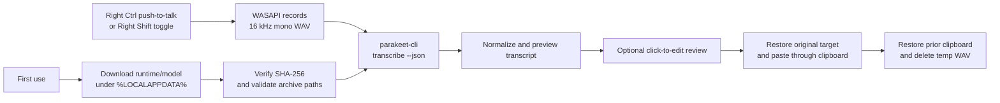

# PTT Dictation

[](https://github.com/DiscoStew6082/ptt-dictation/actions/workflows/ci.yml)

PTT Dictation is a dark-mode-first Windows push-to-talk dictation app that runs speech recognition locally. Hold Right Ctrl, speak, and release: the app records a temporary 16 kHz mono WAV, transcribes it, normalizes the result, pastes it into the active app, and restores the previous clipboard contents when possible.

It is named for the workflow rather than a particular AI vendor or model. The built-in transcription engine currently uses Parakeet models through `parakeet.cpp`, while the application core talks to a replaceable transcription interface.

## Overview

- **Local by design:** Audio and transcripts stay on the machine during transcription. Network access is used only to download selected runtime and model assets.
- **Native Windows workflow:** Global push-to-talk capture, local inference, transcript review, and paste work from the system tray without requiring a browser tab.
- **Replaceable AI boundary:** Dictation orchestration depends on `ITranscriber`; the current adapter provisions `parakeet.cpp` and Parakeet GGUF models.
- **Defensive asset handling:** Built-in downloads use pinned SHA-256 hashes, runtime archives are checked before extraction, and temporary recordings are deleted after use.
- **Reproducible delivery:** Windows CI uses locked NuGet restore, dependency auditing, release packaging, checksums, a CycloneDX SBOM, and build provenance attestations.
- **Stack:** C#, .NET 10, Windows Forms, WASAPI, Windows keyboard hooks, `parakeet.cpp`, GGUF models, and GitHub Actions.

## Features

- Right Ctrl push-to-talk dictation from the system tray.
- Optional Right Shift toggle dictation mode.
- Live recording text plus a final corrected preview; click the final preview to edit before paste.
- Visible first-use runtime/model download progress with cancellable finalization.
- Local transcription with downloadable Parakeet runtime/model assets.
- Session-only transcript history.
- Runtime/model path overrides for local experimentation.
- Dark-mode-first Windows Forms UI.

## How it works



Implementation highlights:

- **Native shell UX:** `NotifyIcon` tray app, dark Windows Forms settings/history windows, non-activating topmost status overlay, and audible state feedback.
- **Audio path:** WASAPI shared-mode capture writes 16-bit, 16 kHz, mono PCM WAV files for `parakeet-cli`.
- **Runtime management:** CUDA is preferred by default, with an automatic CPU retry path if CUDA transcription fails.
- **Asset integrity:** Runtime zip files and built-in GGUF models use pinned SHA-256 checks; extracted runtime files are revalidated through a manifest.
- **Archive hardening:** Runtime zip entries are checked before extraction so archive paths cannot escape the runtime directory.
- **Operational polish:** Process timeout/cancellation handling, single-instance guard, local transcript corrections with preview, best-effort clipboard restoration, session-only transcript history, and cleanup warnings if a temporary WAV cannot be deleted.

## Transcription engines

The current app downloads and runs `parakeet.cpp` with a supported Parakeet GGUF model. That is an implementation choice, not the product identity. Core recording and dictation flows depend on the `ITranscriber` contract, so another local engine can be added behind the same session, preview, correction, history, and paste workflow.

## Start with the interesting code

- [`ChunkedTranscribingDictationSession.cs`](src/PttDictation.Core/ChunkedTranscribingDictationSession.cs) — overlapping-chunk scheduling and incremental transcript assembly.
- [`ParakeetCliTranscriber.cs`](src/PttDictation.Core/ParakeetCliTranscriber.cs) — `parakeet.cpp` process integration, streaming, cancellation, and CUDA-to-CPU fallback.
- [`CoreBehaviorTests.cs`](tests/PttDictation.Tests/CoreBehaviorTests.cs) — behavioral coverage for chunk reconciliation, transcription modes, asset validation, and failure paths.

## Privacy

PTT Dictation is designed for local dictation. Temporary recordings are made on the local machine while dictation is active, transcription is performed by a local `parakeet-cli` runtime, and transcript history is session-only. The app does download runtime/model assets on first use or when you choose a model download in settings.

Trust-boundary notes:

- Paste is implemented through the Windows clipboard. The app remembers the foreground window where recording began, restores that target before paste, temporarily places the reviewed transcript on the clipboard, and attempts to restore the previous clipboard contents afterward. Other local apps with clipboard access may observe clipboard contents while paste is in progress.
- Transcript correction rules are stored locally with settings and are applied before preview, history, and paste.
- The push-to-talk hotkey uses a low-level Windows keyboard hook so the app can detect Right Ctrl while it is running. The hook is used for hotkey state, not transcript collection.
- Runtime/model downloads leave the local machine to fetch third-party artifacts; transcription itself runs locally.

## Requirements

- Windows 11, or Windows 10 installations still receiving security updates.
- A working audio input device.
- An internet connection for the first runtime/model download.

Supported releases target Windows 10/11 on x64. An NVIDIA GPU is optional; the app can fall back to the CPU runtime.

## Install

1. Open the [GitHub Releases page](https://github.com/DiscoStew6082/ptt-dictation/releases).
2. Download `PttDictation-win-x64.zip` and its `.sha256` checksum from the latest release.
3. Optionally verify the download using the command in [Release Verification](#release-verification).
4. Extract the zip to a folder you control and run `PttDictation.exe`.

Release builds are self-contained, so users do not need to install the .NET SDK or runtime. The app is not code-signed yet, so Windows SmartScreen may display a warning.

## First Run

Launch `PttDictation.exe` and leave it running in the system tray. Hold Right Ctrl while speaking, then release it to transcribe and paste. Right Shift starts or stops toggle dictation mode.

On first use the app downloads assets under `%LOCALAPPDATA%\PttDictation`:

- `parakeet.cpp` `v0.4.0` Windows CUDA runtime plus the matching CUDA runtime dependency archive.
- CPU fallback runtime.
- Default `tdt_ctc-110m-f16.gguf` model from `mudler/parakeet-cpp-gguf`.

Expect first-run downloads to be hundreds of MB for the default model and runtime assets. The optional larger multilingual model is about 1.4 GB.

Open the tray menu for settings, model downloads, transcript correction preview, and session-only transcript history.

To try native streaming, open settings and select one of the experimental realtime models:

- `Parakeet Realtime EOU 120M Q8_0`
- `Parakeet Realtime EOU 120M F16`

Leave transcription mode on `Auto` to use native `parakeet-cli --stream` for streaming-capable models and the existing batch/chunked path for batch models. Choose `Batch` or `Streaming` to force a mode while testing.

## Downloaded Assets

This repository is licensed under MIT. The runtime and model assets downloaded on first use are third-party artifacts from their upstream projects:

- `parakeet.cpp` runtime archives are downloaded from the `mudler/parakeet.cpp` GitHub release `v0.4.0`. Runtime archives are verified with pinned SHA-256 hashes before extraction.
- GGUF model files are downloaded from `mudler/parakeet-cpp-gguf` on Hugging Face. Built-in model downloads are checked for minimum expected size and pinned SHA-256 hashes; configure a local model path in settings only when you trust that local model file.

Review the upstream repositories for their own license terms before redistributing bundled runtime or model assets.

## Release Verification

Every published release should include a SHA-256 checksum for the downloadable zip. Users should compare the published checksum with:

```powershell
Get-FileHash .\PttDictation-win-x64.zip -Algorithm SHA256
```

Release builds from this repository publish the zip, checksum, and CycloneDX SBOM. Public tag builds also create a GitHub artifact attestation. Tag builds create a draft GitHub Release so maintainers can review assets before publishing. Recommended additional hardening for broad public distribution includes code signing.

## Current limitations

- Supported builds target Windows 10/11 on x64 only.
- The current controls are Right Ctrl for push-to-talk and Right Shift for toggle dictation.
- First use requires large runtime/model downloads unless you configure trusted local paths.
- Release artifacts are not code-signed yet, so Windows SmartScreen may warn on broad public distribution.

## Build from Source

Contributors need the .NET 10 SDK. Run the test suite and create a self-contained Windows build with:

```powershell
dotnet test PttDictation.sln
dotnet publish src\PttDictation.App\PttDictation.App.csproj -c Release -r win-x64 --self-contained true -o publish\ptt-dictation-win-x64
```

The executable will be written to `publish\ptt-dictation-win-x64\PttDictation.exe`. See [CONTRIBUTING.md](CONTRIBUTING.md) for the complete development and release workflow.

## Validation

Run:

```powershell
dotnet test PttDictation.sln
dotnet publish src\PttDictation.App\PttDictation.App.csproj -c Release -r win-x64 --self-contained true -o publish\ptt-dictation-win-x64
```

Real smoke test performed with `parakeet-v0.4.0-bin-win-cpu-x64.zip` and `tdt_ctc-110m-f16.gguf` against a generated speech WAV:

```json
{"text":"Hello parakeet push to talk."}
```

Chunked dictation smoke checks on July 3, 2026 with the locally installed CPU runtime and default `tdt_ctc-110m-f16.gguf` model:

- `parakeet-cli transcribe --json` returns word-level `words` timing metadata for `smoke\sample.wav`.
- `parakeet-cli transcribe --timestamps` prints word timestamps for the same WAV.
- `parakeet-cli transcribe --stream` is available in the CLI help, but the default model rejects it because streaming requires a cache-aware model such as `parakeet_realtime_eou_120m-v1`.

An overlapped local chunk smoke manually split `smoke\sample.wav` into 2.5 second chunks with 0.8 second overlap and transcribed each chunk through the installed CPU `parakeet-cli`:

Model: `tdt_ctc-110m-f16.gguf` (`f16`)

| Context | Wall time | Transcript |
| --- | ---: | --- |
| chunk 1 | 160 ms | Hello parakeet push to talk. |
| chunk 2 | 149 ms | to talk. |
| full sample | 199 ms | Hello parakeet push to talk. |

Manual microphone validation still needs to confirm end-to-end overlay latency and final paste quality on a real input device:

```text
1. Start PTT Dictation from a local build.
2. Hold Right Ctrl and speak for at least 8 seconds with a pause near a chunk boundary.
3. Confirm partial text appears while recording remains active.
4. Release Right Ctrl and confirm the final pasted transcript is clean.
5. Repeat with Right Shift toggle mode and confirm the second press finalizes transcription.
```

Realtime streaming model smoke can be rerun with:

```powershell
powershell -ExecutionPolicy Bypass -File .\scripts\Test-RealtimeStreaming.ps1 -Runtime both -Iterations 3
```

The script downloads/verifies the two realtime EOU models through `hf` when needed, runs the local smoke WAV through the CPU and CUDA runtimes, and writes `smoke\streaming-smoke-results.md`.

## Contributing

See [CONTRIBUTING.md](CONTRIBUTING.md) for development setup and pull request guidance.

## License

PTT Dictation is available under the [MIT License](LICENSE).
