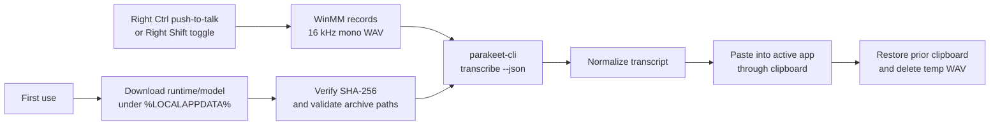

# Parakeet PTT

[](https://github.com/discostew6082/par-win-ptt/actions/workflows/ci.yml)

Parakeet PTT is a local Windows push-to-talk dictation tray app. Hold Right Ctrl, speak, release, and the app records a temporary 16 kHz mono WAV, transcribes it with `parakeet-cli`, normalizes the transcript, pastes it into the active app, and restores your previous clipboard when possible.

## 30-second proof

- **Problem:** Fast dictation should not require a cloud speech service or a browser tab.
- **System:** Native Windows tray app that captures audio, runs local Parakeet speech-to-text, and pastes the cleaned transcript into the active app.
- **Boundary:** Audio and transcripts stay local during transcription; first-use runtime/model downloads are explicit third-party asset fetches.
- **Safety:** Downloaded runtimes and built-in models are checked with pinned SHA-256 hashes, runtime archives are validated before extraction, and temporary recordings are deleted after use.
- **Proof surface:** Windows CI, locked NuGet restore, package audit, release packaging, SHA-256 checksum, CycloneDX SBOM, and public-build artifact attestation.
- **Stack:** C#, .NET 10, Windows Forms, WinMM audio capture, low-level keyboard hook, `parakeet.cpp`, GGUF models, GitHub Actions.

**Recruiter signal:** This project demonstrates local-AI product integration, native Windows API work, secure asset handling, and release engineering rather than only model prompting.

## Features

- Right Ctrl push-to-talk dictation from the system tray.
- Optional Right Shift toggle dictation mode.
- Local transcription with downloadable Parakeet runtime/model assets.
- Session-only transcript history.
- Runtime/model path overrides for local experimentation.
- Dark-mode-first Windows Forms UI.

## How it works



Implementation highlights:

- **Native shell UX:** `NotifyIcon` tray app, dark Windows Forms settings/history windows, non-activating topmost status overlay, and audible state feedback.
- **Audio path:** Direct WinMM capture writes 16-bit, 16 kHz, mono PCM WAV files for `parakeet-cli`.
- **Runtime management:** CUDA is preferred by default, with an automatic CPU retry path if CUDA transcription fails.
- **Asset integrity:** Runtime zip files and built-in GGUF models use pinned SHA-256 checks; extracted runtime files are revalidated through a manifest.
- **Archive hardening:** Runtime zip entries are checked before extraction so archive paths cannot escape the runtime directory.
- **Operational polish:** Process timeout/cancellation handling, single-instance guard, local transcript corrections with preview, best-effort clipboard restoration, session-only transcript history, and cleanup warnings if a temporary WAV cannot be deleted.

## Privacy

Parakeet PTT is designed for local dictation. Temporary recordings are made on the local machine while dictation is active, transcription is performed by a local `parakeet-cli` runtime, and transcript history is session-only. The app does download runtime/model assets on first use or when you choose a model download in settings.

Trust-boundary notes:

- Paste is implemented through the Windows clipboard. The app temporarily places the transcript on the clipboard, sends paste to the active window, and attempts to restore the previous clipboard contents afterward. Other local apps with clipboard access may observe clipboard contents while paste is in progress.
- Transcript correction rules are stored locally with settings and are applied before preview, history, and paste.
- The push-to-talk hotkey uses a low-level Windows keyboard hook so the app can detect Right Ctrl while it is running. The hook is used for hotkey state, not transcript collection.
- Runtime/model downloads leave the local machine to fetch third-party artifacts; transcription itself runs locally.

## Requirements

- Windows 11, or Windows 10 installations still receiving security updates.
- .NET 10 SDK for development.
- A working audio input device.

Supported releases target Windows 10/11 on x64. The app targets .NET 10 LTS, which is supported until November 14, 2028.

## Build

Run the tests:

```powershell
dotnet test ParakeetPtt.sln
```

Publish a portable Windows x64 build:

```powershell
dotnet publish src\ParakeetPtt.App\ParakeetPtt.App.csproj -c Release -r win-x64 --self-contained true -o publish\win-x64
```

Package the published folder as a zip:

```powershell
Compress-Archive -Path publish\win-x64\* -DestinationPath publish\ParakeetPtt-win-x64.zip -Force
```

Create a checksum for release verification:

```powershell
Get-FileHash publish\ParakeetPtt-win-x64.zip -Algorithm SHA256
```

## Try It Locally

Build output is published to:

```text
publish\win-x64\ParakeetPtt.App.exe
```

Portable zip:

```text
publish\ParakeetPtt-win-x64.zip
```

On first real use the app downloads assets under `%LOCALAPPDATA%\ParakeetPtt`:

- `parakeet.cpp` `v0.4.0` Windows CUDA runtime plus the matching CUDA runtime dependency archive.
- CPU fallback runtime.
- Default `tdt_ctc-110m-f16.gguf` model from `mudler/parakeet-cpp-gguf`.

Expect first-run downloads to be hundreds of MB for the default model and runtime assets. The optional larger multilingual model is about 1.4 GB.

Open the tray menu for settings, model downloads, transcript correction preview, and session-only transcript history.

To try native streaming, open settings and select one of the experimental realtime models:

- `Parakeet Realtime EOU 120M Q8_0`
- `Parakeet Realtime EOU 120M F16`

Leave transcription mode on `Auto` to use native `parakeet-cli --stream` for streaming-capable models and the existing batch/chunked path for batch models. Choose `Batch` or `Streaming` to force a mode while testing.

## Downloaded Assets

This repository is licensed under MIT. The runtime and model assets downloaded on first use are third-party artifacts from their upstream projects:

- `parakeet.cpp` runtime archives are downloaded from the `mudler/parakeet.cpp` GitHub release `v0.4.0`. Runtime archives are verified with pinned SHA-256 hashes before extraction.
- GGUF model files are downloaded from `mudler/parakeet-cpp-gguf` on Hugging Face. Built-in model downloads are checked for minimum expected size and pinned SHA-256 hashes; configure a local model path in settings only when you trust that local model file.

Review the upstream repositories for their own license terms before redistributing bundled runtime or model assets.

## Release Verification

Every published release should include a SHA-256 checksum for the downloadable zip. Users should compare the published checksum with:

```powershell
Get-FileHash .\ParakeetPtt-win-x64.zip -Algorithm SHA256
```

Release builds from this repository publish the zip, checksum, and CycloneDX SBOM. Public tag builds also create a GitHub artifact attestation. Tag builds create a draft GitHub Release so maintainers can review assets before publishing. Recommended additional hardening for broad public distribution includes code signing.

## Current limitations

- Supported builds target Windows 10/11 on x64 only.
- The current controls are Right Ctrl for push-to-talk and Right Shift for toggle dictation.
- First use requires large runtime/model downloads unless you configure trusted local paths.
- Release artifacts are not code-signed yet, so Windows SmartScreen may warn on broad public distribution.

## Validation

Run:

```powershell
dotnet test ParakeetPtt.sln
dotnet publish src\ParakeetPtt.App\ParakeetPtt.App.csproj -c Release -r win-x64 --self-contained true -o publish\win-x64
```

Real smoke test performed with `parakeet-v0.4.0-bin-win-cpu-x64.zip` and `tdt_ctc-110m-f16.gguf` against a generated speech WAV:

```json
{"text":"Hello parakeet push to talk."}
```

Chunked dictation smoke checks on July 3, 2026 with the locally installed CPU runtime and default `tdt_ctc-110m-f16.gguf` model:

- `parakeet-cli transcribe --json` returns word-level `words` timing metadata for `smoke\sample.wav`.
- `parakeet-cli transcribe --timestamps` prints word timestamps for the same WAV.
- `parakeet-cli transcribe --stream` is available in the CLI help, but the default model rejects it because streaming requires a cache-aware model such as `parakeet_realtime_eou_120m-v1`.

An overlapped local chunk smoke manually split `smoke\sample.wav` into 2.5 second chunks with 0.8 second overlap and transcribed each chunk through the installed CPU `parakeet-cli`:

Model: `tdt_ctc-110m-f16.gguf` (`f16`)

| Context | Wall time | Transcript |
| --- | ---: | --- |
| chunk 1 | 160 ms | Hello parakeet push to talk. |
| chunk 2 | 149 ms | to talk. |
| full sample | 199 ms | Hello parakeet push to talk. |

Manual microphone validation still needs to confirm end-to-end overlay latency and final paste quality on a real input device:

```text
1. Start Parakeet PTT from a local build.
2. Hold Right Ctrl and speak for at least 8 seconds with a pause near a chunk boundary.
3. Confirm partial text appears while recording remains active.
4. Release Right Ctrl and confirm the final pasted transcript is clean.
5. Repeat with Right Shift toggle mode and confirm the second press finalizes transcription.
```

Realtime streaming model smoke can be rerun with:

```powershell
powershell -ExecutionPolicy Bypass -File .\scripts\Test-RealtimeStreaming.ps1 -Runtime both -Iterations 3
```

The script downloads/verifies the two realtime EOU models through `hf` when needed, runs the local smoke WAV through the CPU and CUDA runtimes, and writes `smoke\streaming-smoke-results.md`.

## Contributing

See [CONTRIBUTING.md](CONTRIBUTING.md) for development setup and pull request guidance.

## License

Parakeet PTT is available under the [MIT License](LICENSE).
